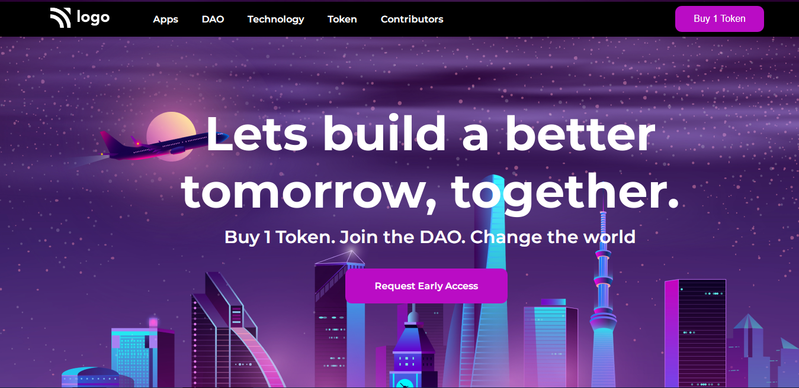

# Project - 05

### Better Tomorrow (Landing Page)

---

## About project
---

Only HTML and CSS Were Used To Create This Project. A variety of HTML and CSS properties are used to create this lovely landing page.
This page have a Backgrond image, Hero Text On The Very Center Of Page, Navbar with Action Button.

---

## Learning Experience
---
This Project Taught Me How To Adjust Background Image Respected to Content.

## How Much Time I Took To Finish This Project...? 
>Overall, it took me two hours to do this project. Yes, there was trial and error as well as learning and exploration.

---

##  Special Thanks To : [Hitesh Choudhary Sir](https://www.instagram.com/hiteshchoudharyofficial/?hl=en)  And [Ineuron](https://ineuron.ai/course/Full-Stack-Javascript-Web-Developer)

>Thank You Very Much For This Amazing Course.

---

## Screenshot 

[Live Link](https://darling-speculoos-68f005.netlify.app/)

---

>## Who Am I ?

>My Name Is Karan I am A Learner Who is Interested in Sharing Knowledge About The Skills That I'm Developing to Become A Full-Stack Web Developer.

>## Check Out My Work on 

>[Netlify](https://app.netlify.com/teams/karan9846/overview?_ga=2.175703073.206776847.1659963657-634189433.1659791041)

>[FindCoder](https://www.findcoder.io/u/karan18)

>[hashnode](https://hashnode.com/@karan787)

>Let's get Connected [@karanjaria](https://www.instagram.com/karanjaria/?hl=en)